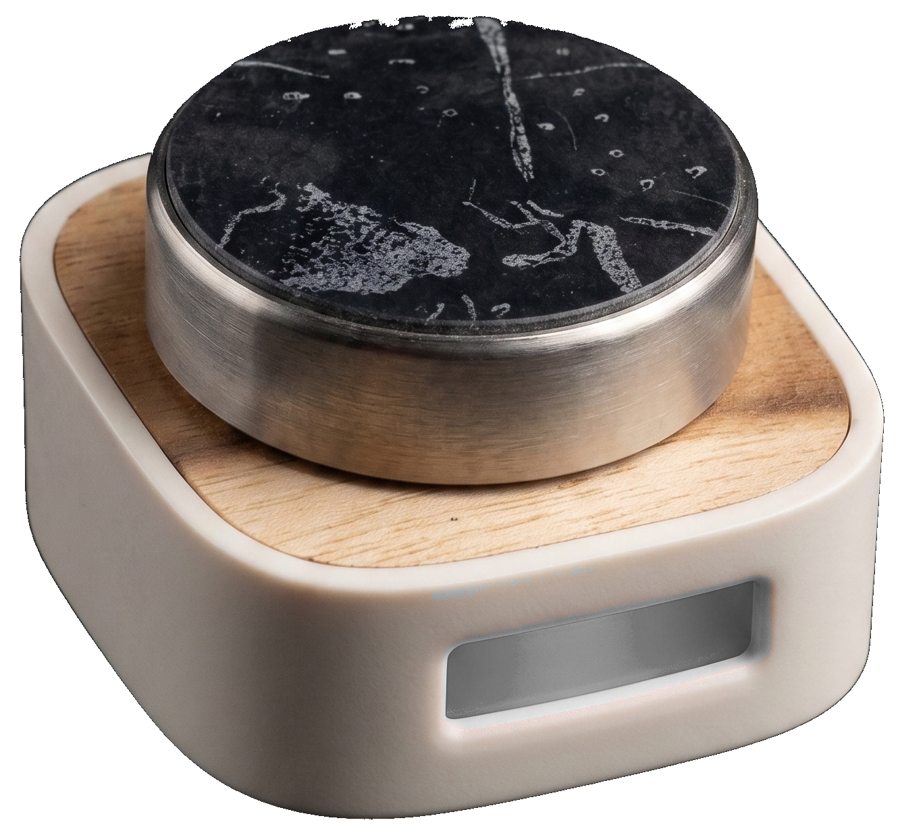

# OmniScroll (Omni Scroll) — DIY Haptic Rotary Dial & Optical Scroll Wheel

**OmniScroll** (also commonly searched as **Omni Scroll**) is an open-source, custom haptic rotary dial and computer input controller built around a freely spinning steel ball bearing and an MX8650 optical mouse sensor. It connects to any PC or Mac as a standard USB HID device with zero drivers or companion software required. Configure haptic detents, modes, RGB calibration, and flick gestures directly from any Chromium browser (Chrome, Edge, Brave, Opera) over the same USB cable using the Web Serial API.

  

---

## Live Web Configurator

Plug in your OmniScroll device via USB, then open the zero-install control panel:

👉 **[roufsweb.github.io/OmniScroll](https://roufsweb.github.io/OmniScroll/)**

*No drivers, companion apps, or background processes required. Runs 100% in-browser over the Web Serial API.*

---

## Key Features

- **Zero-Contact Optical Sensing**: An MX8650 optical sensor tracks the microscopic surface texture of an industrial steel ball bearing. No mechanical encoder contacts, zero friction wear, and limitless rotational lifespan.
- **Native High-Resolution Smooth Scrolling**: Implements Microsoft & USB-IF compliant Generic Desktop Usage `0x48` (Resolution Multiplier) for fluid, sub-pixel continuous scrolling on Windows and macOS.
- **Apple-Grade LRA Haptic Detents**: An iPhone 6 Linear Resonant Actuator (LRA) driven by a PAM8403 amplifier produces crisp, virtual tactile clicks with tunable frequency, duration, and sharpness.
- **TinyOL On-Device Gesture Engine**: Adaptive prototype recognition detects rapid ballistic flick gestures (back/forward navigation, tab switching, undo/redo) and dynamically adapts to your personal ergonomics without flash wear.
- **Touch & Spin Gated Modifier**: Hold the top capacitive disk while rotating to trigger secondary modifier actions (horizontal pan, universal zoom, 4x turbo scroll).
- **8 Workflow Modes**: Seamlessly switch between dedicated modes with customized detent feel and RGB LED backlighting.
- **Full NVS Persistence**: All settings, calibrations, and learned gesture centroids persist directly in ESP32 flash across reboots.

---

## How It Works

A freely spinning ball bearing acts as the dial. An MX8650 optical mouse sensor sits directly beneath it, reading the surface texture of the bearing as it rotates. This replaces a traditional mechanical rotary encoder entirely — no physical contacts, no wear, and no fixed step resolution.

The "clicks" you feel are not mechanical. An LRA (Linear Resonant Actuator) driven by a PAM8403 amplifier fires a precise tone burst on each virtual detent. Frequency, duration, and intensity are all tunable from the configurator.

---

## Modes

The dial operates in configurable modes. Double-tap the top touch zone or perform a configured flick gesture to cycle between active modes.

| Mode | Action | Default LED Color |
|---|---|---|
| **Scroll** | High-resolution vertical page scroll | Blue |
| **Volume** | System volume control (with detents) | Green |
| **Timeline** | Frame-by-frame arrow keys (scrubbing) | Pink |
| **Zoom** | Ctrl+Scroll — universal zoom in any app | Amber |
| **Horizontal Scroll** | Side-scroll axis / Pan | Teal |
| **Brightness** | Display brightness keys | Yellow |
| **Tabbing** | Ctrl+Tab — cycle browser & app tabs | Violet |
| **Undo / Redo** | Ctrl+Z / Ctrl+Shift+Z | Red |

All 8 modes are individually configurable. Enable only the ones you use. Colors, step thresholds, invert directions, and haptic detent profiles are saved per mode.

---

## Hardware Architecture

| Component | Part | Notes |
|---|---|---|
| **Microcontroller** | Lolin ESP32-S2 Mini | Native USB OTG, hardware touch peripheral, LEDC PWM |
| **Encoder** | MX8650 Optical Sensor | Reads bearing surface via 2-wire serial protocol |
| **Haptic Motor** | iPhone 6 LRA | Driven by PAM8403 audio amplifier |
| **Indicator** | Analog 5050 RGB LED | Software white-balanced via PWM hardware calibration |
| **Touch Input** | ESP32-S2 capacitive touch (GPIO 12) | Hardware-filtered, double-tap, long-press, & touch-hold |

Full schematic, pin mapping, and electrical notes are documented in [HARDWARE.md](HARDWARE.md).

---

## Configurable Settings

All settings are stored in the ESP32's NVS flash and survive power cycles:

- **Haptic Detent Profile** — Choose from Click, Thud, Tick, Soft, or Off. Set independently per mode.
- **RGB Color Palette** — Full HSB color wheel with hardware white-balance PWM calibration.
- **Sensor Resolution** — 400 / 800 / 1200 / 1600 CPI.
- **Touch Sensitivity Slider** — Continuous 0% to 100% threshold calibration for your hand.
- **LED Brightness & Standby** — Master dimmer (0–100%) and organic MagSafe amber breathing when host is asleep.
- **Flick Gestures** — Configurable ballistic actions (Forward / Back navigation, Play/Pause, Next/Prev Mode).
- **Direction Invert** — Reverse rotation direction per mode.

---

## Building the Firmware

Requires the [Arduino IDE](https://www.arduino.cc/en/software) with the ESP32 board package installed (v3.x+).

**Board Settings:**

| Setting | Value |
|---|---|
| Board | Lolin S2 Mini |
| USB CDC On Boot | Disabled (`CDCOnBoot=dis_cdc`) |
| Partition Scheme | Huge APP |

**Flash Procedure:**
1. Hold the `BOOT` button on the board.
2. Press and release `RST`.
3. Release `BOOT` (enters Download Mode).
4. Run `python upload.py` or flash directly from the Arduino IDE.

---

## Frequently Asked Questions (FAQ)

### What is OmniScroll (Omni Scroll)?
OmniScroll is a custom DIY haptic rotary dial and smart optical wheel controller designed for creators, developers, audio/video editors, and power users. Instead of traditional notched mechanical encoders, it uses an optical sensor reading an industrial bearing, giving it virtually infinite lifespan and completely customizable digital haptic feedback.

### How do I configure my Omni Scroll wheel?
Simply connect the device to your computer via USB, open [roufsweb.github.io/OmniScroll](https://roufsweb.github.io/OmniScroll/) in Chrome or Edge, and click **Connect Device**. The Web Serial API handles all communication directly inside the browser without installing any companion software.

---

## License

[MIT](LICENSE) © [Rouf](https://github.com/roufsweb)
