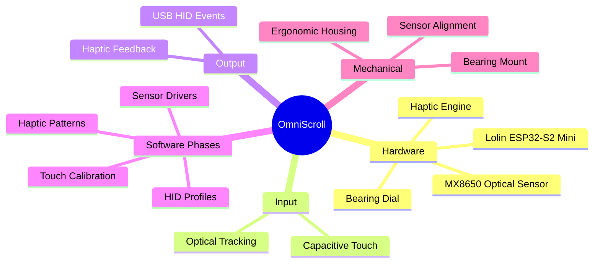

# OmniScroll - Project Walkthrough

## Mind Map

## Step-by-Step Implementation Guide

### Phase 1: Hardware Prototyping & Bring-up
1. **MCU Setup**: Flash the ESP32-S2 Mini with a basic testing firmware to verify USB/serial connectivity.
2. **Sensor Integration**: Wire the MX8650 to the ESP32-S2. Implement basic driver code (usually reading registers via SPI or a custom 2-wire interface) to retrieve X/Y displacement data.
3. **Haptic Engine Wiring**: Connect the haptic engine to the ESP32-S2. Test basic vibration patterns to ensure the motor provides distinct "clicks".
4. **Touch Testing**: Connect conductive tape or pads to the ESP32-S2 touch pins. Read raw touch data and calibrate thresholds for distinct presses.

### Phase 2: Mechanical Mockup
1. **Bearing Mounting**: Design and 3D print a mount that holds the bearing securely while allowing it to spin freely with minimal friction.
2. **Sensor Alignment**: Position the MX8650 directly facing the bearing's tracking surface. Ensure the distance is within the sensor's optical focal range.
3. **Surface Prep**: Apply a trackable texture or pattern to the area of the bearing being read by the optical sensor if the bare metal is too reflective or smooth.

### Phase 3: Software - Core Logic
1. **Optical to Scroll**: Translate MX8650 displacement readings into rotational metrics. Apply filtering, smoothing, and acceleration curves for a natural scroll feel.
2. **Touch Debouncing**: Implement robust software debouncing and baseline tracking for the capacitive touch inputs to ensure reliable "clicks" without false triggers.
3. **Haptic Sync**: Trigger haptic feedback precisely when the touch inputs register a click. Implement "virtual detents" by pulsing the haptics at specific displacement intervals from the optical sensor data.

### Phase 4: HID Integration
1. **Device Profile**: Configure the ESP32-S2 as a composite USB HID device (Mouse + Consumer Control/Keyboard).
2. **Event Mapping**: 
   - Map the processed optical rotation to scroll wheel events.
   - Map touch inputs to mouse clicks or media keys.
3. **Multi-Function Switching**: Implement a logic state machine where a specific touch combination switches the dial's function (e.g., from scrolling to volume control, zooming, or scrubbing), accompanied by a distinct haptic buzz to alert the user of the mode change.

### Phase 5: Refinement & Enclosure
1. **PCB Design**: Move from a breadboard or perfboard prototype to a custom PCB for a smaller footprint and better signal integrity.
2. **Final Enclosure**: Design a premium, ergonomic 3D printed or machined housing enclosing the MCU, sensor, and haptics, leaving only the bearing and touch zones exposed.
3. **Firmware Tuning**: Fine-tune haptic intensity, touch sensitivity, scroll acceleration, and mode switching logic based on real-world feel.
